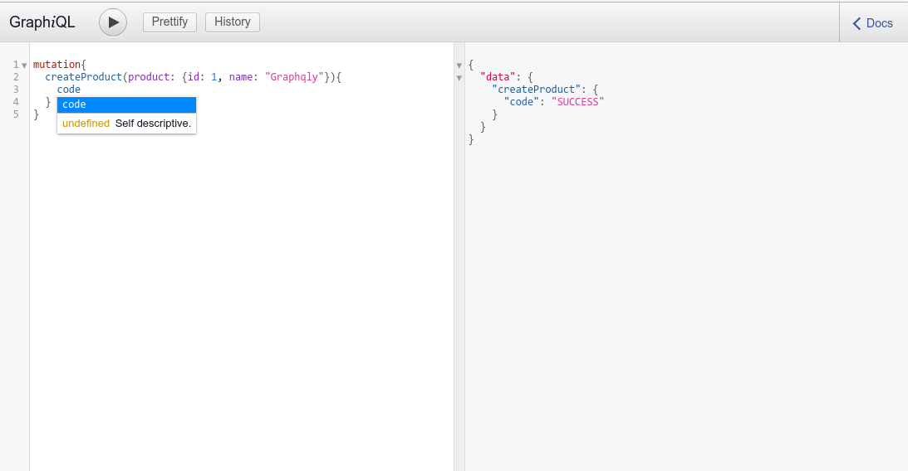

Graphqly demo
=================

This is a demo of using `graphqly` with `hapi` to develop Graphql services

### Installation

```
git clone git@github.com:anhldbk/graphqly-demo.git
cd graphqly-demo
npm install
npm start

# if you're using yarn
# yarn install
# yarn start

```

### Usage

Please navigate to [http://localhost:8080/api/graphiql](http://localhost:8080/api/graphiql) to play with the provided services


